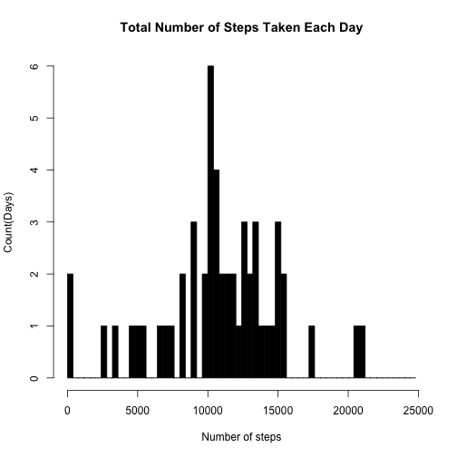
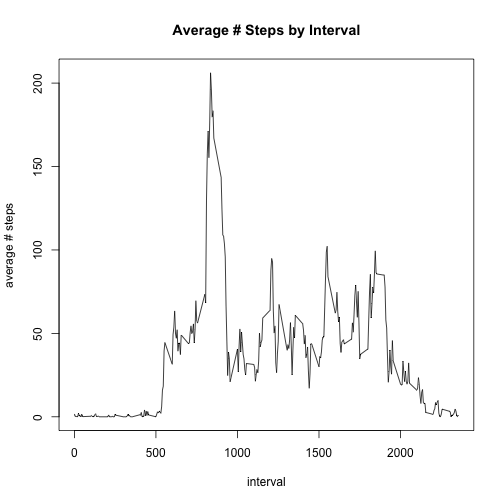
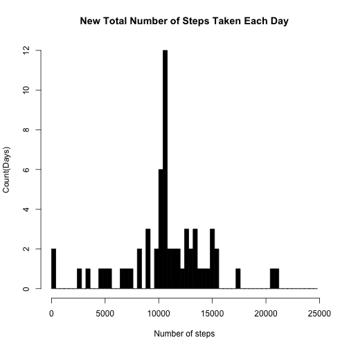
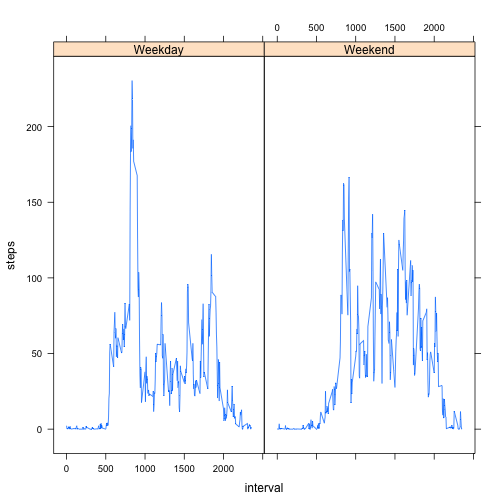

Here we unzip the "activity.zip" file that's in our working directory after we forked it, and then we convert it into a data frame called StepsData using read.csv.
Then I converted the Date column of the data frame from factor into Date objects.


```r
StepsData <- read.csv(unzip("activity.zip"))
StepsData$date <- as.Date(StepsData$date)
```


Here we use the aggregate function to create a data frame with the total number of steps taken by day. Then I use the hist function to create a histogram of that data.

```r
TotalStepsByDay <- aggregate(steps~date, StepsData, FUN = sum)
hist(TotalStepsByDay$steps, xlab= "Number of steps", ylab = "Count(Days)",main = "Total Number of Steps Taken Each Day", breaks = seq(0,25000, 400), col = "black")
```

 

Here I calculate the mean steps per day is 10766.19 and the median steps per day is 10765

```r
mean(TotalStepsByDay$steps)
```

```
## [1] 10766.19
```

```r
median(TotalStepsByDay$steps)
```

```
## [1] 10765
```

Use aggregate() to create variable AverageStepsByInterval which is a data frame with the average number of steps taken daily by time interval.
THen I use the plot function with type "l" to create a time series with that data.

```r
AverageStepsByInterval <- aggregate(steps~interval, StepsData, FUN = mean)
plot(AverageStepsByInterval$interval, AverageStepsByInterval$steps, type = "l", xlab = "interval", ylab = "average # steps", main = "Average # Steps by Interval")
```

 


Here I calculate that the time interval 835 has the highest amount if average steps taken.

```r
AverageStepsByInterval[which(AverageStepsByInterval$steps == max(AverageStepsByInterval$steps)),]
```

```
##     interval    steps
## 104      835 206.1698
```


Here I calculate there are 2304 rows with NA for steps

```r
sum(is.na(StepsData$steps))
```

```
## [1] 2304
```


Here I replace the NA's in StepsData with the avereage the number of steps taken in the corresponding interval of the NA 

```r
ImputedStepsData <- StepsData
for (i in 1:length(ImputedStepsData$steps)) {
  if (is.na(ImputedStepsData$steps[i])) {
    IntervalForNA <- ImputedStepsData$interval[i]
    ImputedStepsData$steps[i] <- AverageStepsByInterval[which(AverageStepsByInterval$interval == IntervalForNA)[1], 2]
  }
} 
```


Here I create a histogram of the new total number of steps taken each day using the new data

```r
NewTotalStepsByDay <- aggregate(steps~date, ImputedStepsData, FUN = sum)
hist(NewTotalStepsByDay$steps, xlab= "Number of steps", ylab = "Count(Days)",main = "New Total Number of Steps Taken Each Day", breaks = seq(0,25000, 400), col = "black")
```

 

Here I calculate the mean and median daily steps taken of the new Data. The new mean and the new median  are both 10766.19. The mean hasn't changed from before but the median has increased.


```r
mean(NewTotalStepsByDay$steps)
```

```
## [1] 10766.19
```

```r
median(NewTotalStepsByDay$steps)
```

```
## [1] 10766.19
```


Here we convert the dates into days of the week and then categorize the days of the week into either "weekday" or "weekend". THen we compare the average steps by interval with respect to weekdays, and also separately with respect to weekends using a time series panel plot.

```r
ImputedStepsData$day <- weekdays(ImputedStepsData$date)
ImputedStepsData$day[ImputedStepsData$day %in% c("Monday", "Tuesday", "Wednesday", "Thursday", "Friday")] <- "Weekday"
ImputedStepsData$day[ImputedStepsData$day %in% c("Saturday", "Sunday")] <- "Weekend"
ImputedStepsData$day <- factor(ImputedStepsData$day)
NewAverageStepsByInterval <- aggregate(steps~interval + day, ImputedStepsData, FUN = mean)
library("lattice")
xyplot(steps ~interval|day, data= NewAverageStepsByInterval, type = "l")
```

 

